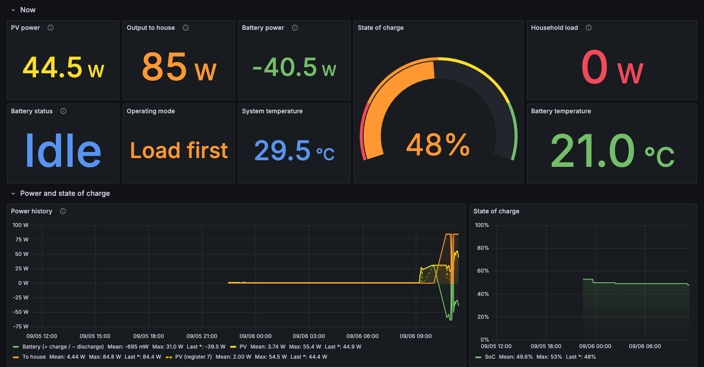
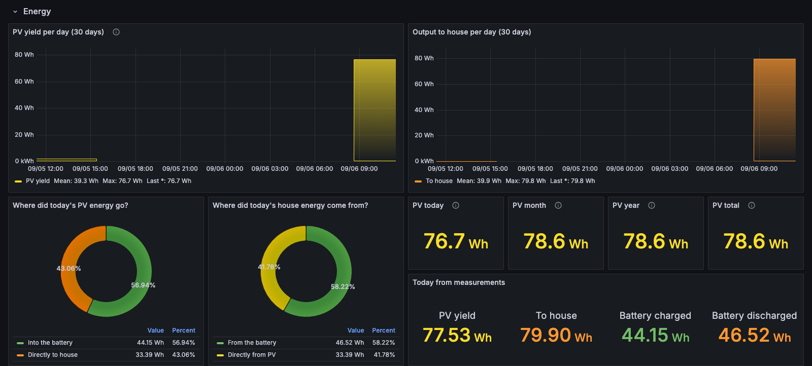
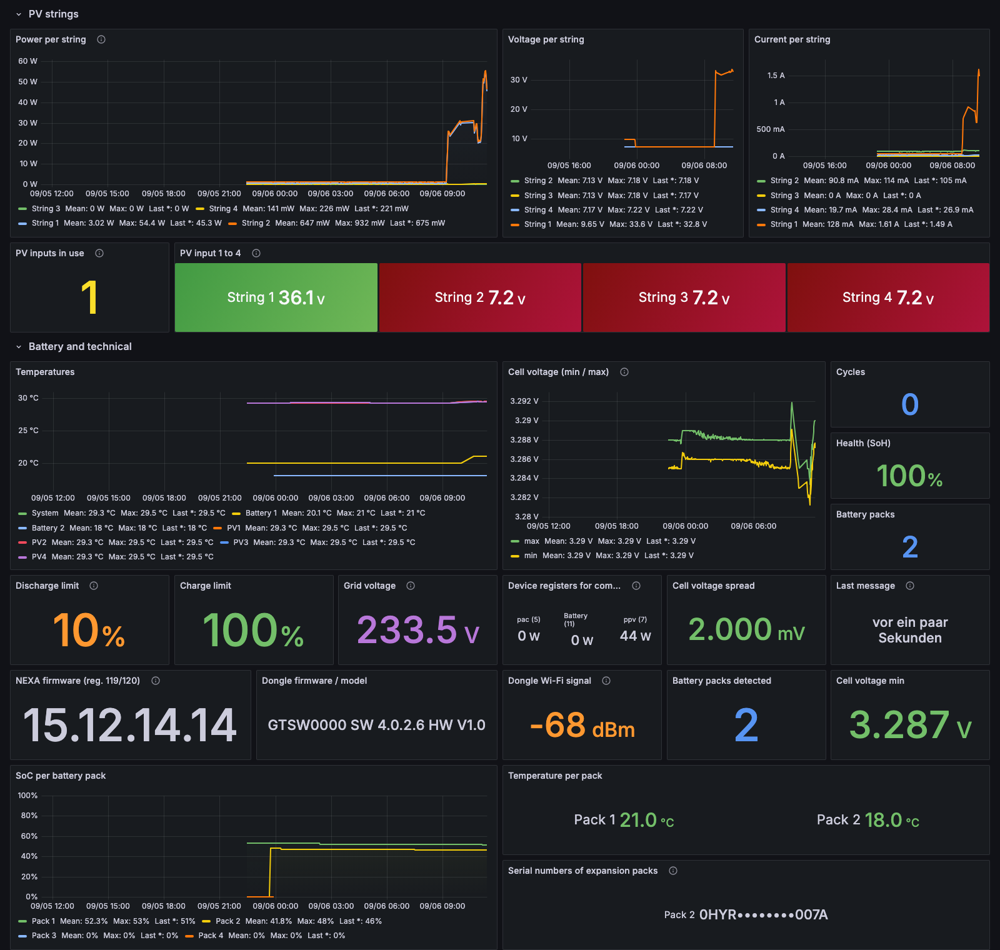
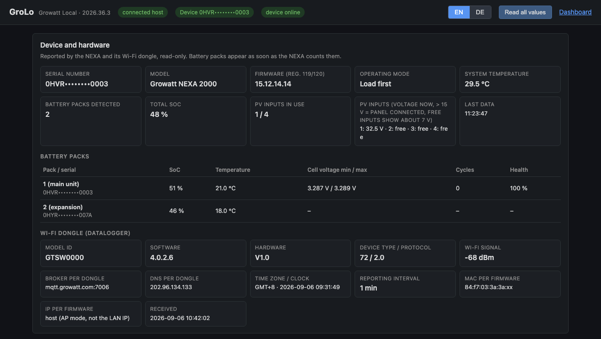
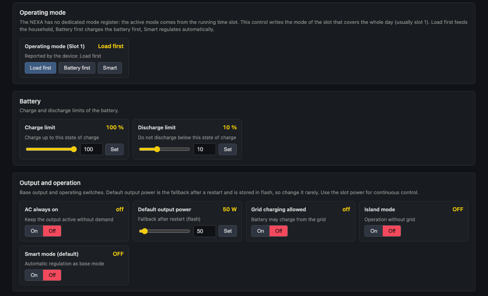
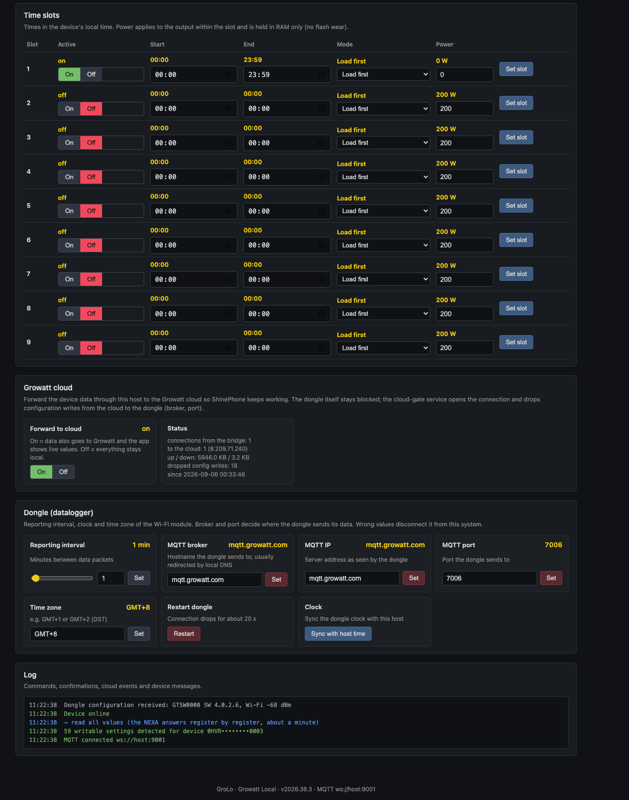

# GroLo · For Growatt but Local

**Local monitoring and control for the Growatt NEXA 2000 balcony battery, without the manufacturer cloud.**
A Docker Compose stack: TLS MQTT broker for the Growatt Wi-Fi dongle, [GroBro](https://github.com/robertzaage/GroBro) for decoding,
InfluxDB + Grafana for history, a bilingual settings page (EN/DE), and three small helper services for hardware info, raw registers and
an optional, switchable relay to the Growatt cloud.

Version **2026.37.3** · Runs on any host with Docker (developed on macOS, tested with NEXA 2000 firmware 4.0.2.6 and two battery packs).

## Screenshots

**Grafana dashboard** (English, German available): live tiles, power history and state of charge.



Energy per day, where today's PV energy went and where the house energy came from.



PV strings with detected inputs, temperatures, cell voltages, packs, firmware and dongle.



**GroLo settings page**: device and hardware, battery packs, dongle.



Operating mode, battery limits, output and operating switches.



Time slots, cloud relay with status, dongle settings and log.



## How it works

```
NEXA dongle ──TLS :7006──▶ Mosquitto ──▶ GroBro (decode) ──▶ Mosquitto :1883 ──▶ Telegraf ──▶ InfluxDB ──▶ Grafana :3000
                                             │                      │
                                             │                      └──▶ GroLo settings page :8080 (WebSocket :9001)
                                             └──▶ cloud-gate ──TLS──▶ mqtt.growatt.com   (optional, switchable, filtered)
```

The dongle is never reconfigured. Instead your router resolves `mqtt.growatt.com` to the host running this stack, and the
stack presents a certificate from a public CA that the dongle's firmware trusts. Everything the dongle sends is decoded
locally; nothing leaves your network unless you switch the cloud relay on.

**Why a real certificate?** The Growatt firmware only trusts built-in public root CAs and verifies the complete chain, but it
does **not** check the hostname. A free Let's Encrypt certificate for any domain you control is enough. Self-signed
certificates are rejected. Details: [GroBro CERTIFICATES.md](https://github.com/robertzaage/GroBro/blob/main/CERTIFICATES.md).

## Requirements

- A host in the same LAN as the NEXA with Docker and Docker Compose (Linux, macOS with Docker Desktop, Colima or OrbStack, Windows with WSL2).
- A router whose DNS lets you add local records (UniFi, FritzBox with Pi-hole/AdGuard, OpenWrt, pfSense, …).
- A DNS name you control for the certificate. The easiest free option is a [DuckDNS](https://www.duckdns.org) subdomain.
- [acme.sh](https://github.com/acmesh-official/acme.sh) for the certificate (`brew install acme.sh` or the install script), plus
  `mosquitto_sub`/`mosquitto_pub` for the checks (`brew install mosquitto` or `apt install mosquitto-clients`).
- Python 3 and Node.js are only needed for the optional test scripts.

## Installation

### 1. Clone and configure

```bash
git clone https://github.com/csieb2001/grolo.git && cd grolo
cp .env.example .env
```

Edit `.env`:

| Variable | Meaning |
|---|---|
| `DUCKDNS_DOMAIN`, `DUCKDNS_TOKEN` | your DuckDNS subdomain (without `.duckdns.org`) and the account token |
| `ACME_EMAIL` | contact address for Let's Encrypt expiry mails (optional) |
| `INFLUX_ADMIN_PASSWORD`, `INFLUX_TOKEN`, `GRAFANA_ADMIN_PASSWORD` | choose your own; `openssl rand -hex 32` for the token |
| `CLOUD_HOSTS` | IP addresses of `mqtt.growatt.com` as seen from **outside** your LAN (`dig mqtt.growatt.com @1.1.1.1`) |
| `GROBRO_MAX_SLOTS` | number of time slots to expose (NEXA: 9) |
| `WEATHER_LAT`, `WEATHER_LON` | plant location for weather and sun position (starting value; the settings page can change it later) |
| `STRING1_TILT`, `STRING1_AZIMUTH`, `STRING1_WP` … | panel tilt/azimuth/Wp per string for the expected-yield model (optional, also editable on the settings page) |

### 2. DuckDNS

1. Sign in at [duckdns.org](https://www.duckdns.org) (GitHub, Google, Reddit or X login).
2. Add a subdomain, e.g. `my-nexa` → `my-nexa.duckdns.org`.
3. Set its IP to the **LAN IP of your Docker host** (e.g. `192.168.1.50`). The record is public but points into your LAN, which is
   fine: the certificate is issued via DNS-01 and never needs an inbound connection.
4. Copy the token shown at the top of the page into `.env`.

### 3. Certificate

```bash
scripts/setup-certs.sh
```

The script issues a Let's Encrypt certificate via `acme.sh --dns dns_duckdns`, installs `cert.pem`, `privkey.pem` and the
intermediates into `mosquitto/certs/` and runs `scripts/build-chain.sh`, which appends the matching ISRG root and verifies
the chain with OpenSSL. Renewal runs through acme.sh's cron or, on macOS, a launchd job (see comments in the script); the
reload hook rebuilds the chain and restarts Mosquitto.

Notes that cost us time:

- acme.sh defaults to ZeroSSL, whose root is **not** in the Growatt firmware. The script forces `--server letsencrypt`.
- Since 2026 the Let's Encrypt chain has **four** certificates (`cert → YE1 → Root YE → ISRG Root X2`). The dongle needs all of
  them including the root, which is why `chain-full.pem` is built explicitly instead of using acme.sh's `fullchain.cer`.
- The private key is world-readable (0644) inside `mosquitto/certs/` because the Mosquitto container runs as uid 1883 and
  bind mounts from macOS do not map uids. Acceptable for a home setup; use a named volume if you prefer.

### 4. Start

```bash
docker compose up -d
scripts/verify.sh
```

`verify.sh` runs 14 checks: certificate chain and expiry, TLS handshake exactly like the dongle does it (root as the only trust
anchor), MQTT round trip, GroBro connected to both listeners, ports reachable on the LAN IP, InfluxDB receiving data, all
Grafana panel queries, settings page and WebSocket, hardware-info sidecar, raw-register sidecar and cloud relay.

### 5. Router: DNS and firewall

1. **Local DNS records** (Router → DNS / Local DNS / DNS rewrite):
   - `mqtt.growatt.com` → LAN IP of the Docker host
   - `<your-sub>.duckdns.org` → LAN IP of the Docker host (optional if the public DuckDNS record already points there)

   The dongle resolves `mqtt.growatt.com`, gets your host, opens TLS, sees a valid public-CA chain and logs in with its serial
   number. No change on the device is needed. GroBro's guide describes the alternative of changing the broker in the device via
   [openapi.growatt.com](https://openapi.growatt.com) → Datalogger Setting.
2. **Block the dongle from the internet** (Firewall → policy: source = the dongle's MAC/IP, destination = WAN, drop). Without this the
   dongle would reconnect to the real cloud as soon as your DNS record is gone, and the cloud could rewrite its broker settings.
3. Make the dongle reconnect once: reboot it from the settings page later, or briefly block its current connection. It reconnects
   within seconds and lands on your broker. `docker compose logs -f mosquitto` shows `New client connected … as <serial>`.

UniFi example: Settings → Routing → DNS for the records; Settings → Security → Firewall → Create Policy, zone Internal →
External, source the dongle client, action Block.

### 6. Open

| Service | URL | Notes |
|---|---|---|
| GroLo settings page | `http://<host>:8080` (also `http://<host>:3000/public/grolo/index.html`, the *Settings* link in Grafana) | EN/DE toggle, no login |
| Grafana | `http://<host>:3000` | English dashboard is the home page, German via the link at the top; viewing without login, editing as `admin` |
| InfluxDB | `http://127.0.0.1:8086` | bound to localhost only |

### Running on Proxmox (LXC)

The stack runs fine in an unprivileged Debian 12 container with Docker inside. Create it with nesting and keyctl enabled,
install Docker from the official repository, clone the repo to `/opt/growatt` (the directory name becomes the Compose
project name and thus the volume prefix) and continue with the steps above. Give the container a fixed IP in your router so
the DNS records stay valid.

```bash
pct create 103 local:vztmpl/debian-12-standard_12.7-1_amd64.tar.zst --hostname grolo --unprivileged 1 \
  --features nesting=1,keyctl=1 --cores 2 --memory 3072 --rootfs local-lvm:24 \
  --net0 name=eth0,bridge=vmbr0,ip=dhcp --onboot 1
```

Moving an existing installation: `influx backup` / `influx restore --full` for the database, `tar` the small volumes
(`grafana-data`, `mosquitto-data`, `cloud-gate-state`), copy `.env`, `mosquitto/certs/` and `~/.acme.sh/`, then switch the
two DNS records. The dongle reconnects within seconds; the gap in our move was a single 5-second sample.

## What you get

**Settings page (GroLo)**: device and hardware (serial, firmware register, packs with serial/SoC/temperature, PV inputs in use,
dongle model/software/Wi-Fi signal), operating mode switch, charge/discharge limits, output power, operating switches, all
9 time slots, cloud relay switch with status, dongle settings (interval, time zone, clock sync, restart), and a log with
confirmations from the device. Controls are generated from GroBro's Home Assistant discovery, so anything GroBro exposes appears
automatically. Every write is confirmed by reading the register back. A **Location and panels** section sets the plant location
by place or postcode search (Open-Meteo geocoding) and tilt/azimuth/Wp per string; it is stored as a retained MQTT message
(`homeassistant/grolo/config/site`) and picked up by the weather service immediately.

**Grafana**: live tiles (PV from the strings, output from register 116, battery as balance), power history, SoC, daily energy
bars, energy split pies, today/month/year/total energy computed from measurements, per-string power/voltage/current, PV inputs
in use (> 15 V), a **Daily peaks, sun position and model** row (see below), temperatures, cell voltages, packs, firmware and dongle info, and a research row with the raw registers GroBro
does not know yet. Free MPPT inputs read about 7 V on the NEXA, connected panels 30 V and more.

**MQTT topics** (prefix `homeassistant/`, GroBro's namespace):

| Topic | Purpose |
|---|---|
| `grobro/<serial>/state` | decoded state JSON, every few seconds |
| `number|switch|select|time/grobro/<serial>/<name>/set` and `.../get` | write a setting, read back the confirmation |
| `button/grobro/<serial>/read_all/read` | read every setting from the device (about a minute) |
| `config/grobro/<serial>/<register>/set` | dongle configuration: 4 interval, 30 time zone, 31 clock sync, 32 restart |
| `grobro/<serial>/dongle` | dongle hardware info (retained, from the `dongle-info` sidecar) |
| `grobro/<serial>/raw_input`, `.../raw_holding` | all raw registers (from the `raw-registers` sidecar) |
| `switch/grobro/cloud_forward/set`, `.../get`, `grobro/cloud_forward/status` | cloud relay switch and status |

Example:

```bash
mosquitto_pub -h <host> -t homeassistant/number/grobro/<serial>/slot1_power/set -m 300
mosquitto_sub -h <host> -t 'homeassistant/+/grobro/<serial>/+/get' -v
```

## Weather (Open-Meteo)

The `weather` service fetches solar-relevant weather for the plant location from [Open-Meteo](https://open-meteo.com) (free, no
API key) every 10 minutes: temperature, cloud cover, WMO weather code, global/direct/diffuse irradiance, wind, sunrise and
sunset, forecast sunshine hours and daily irradiation sum, plus an hourly 48-hour forecast. Set `WEATHER_LAT` / `WEATHER_LON`
in `.env`. Current values go to `homeassistant/grolo/weather/current` (retained JSON with plain-text conditions in EN/DE),
`.../weather/state` feeds Telegraf (measurement `weather`), and the forecast is written straight into InfluxDB as
`weather_forecast` with the forecast hour as timestamp, so newer forecasts overwrite older ones.

Grafana row **Weather**: outdoor temperature, conditions, cloud cover, global irradiance, sunrise/sunset, sunshine hours,
irradiation sum today/tomorrow, irradiance versus PV power on two axes (shading, orientation and soiling show up here),
cloud cover and temperature, and the 48-hour forecast of irradiance and cloud cover.

## Daily peaks, sun position and expected yield

The weather service also computes the **sun position** (azimuth/elevation, NOAA algorithm in `grobro/sidecar/solar.py`) every
minute (`homeassistant/grolo/sun`, measurement `sun`) and, for every string with tilt/azimuth configured, the **expected power**
per hour for the last 24 h and the next 48 h: Open-Meteo direct-normal, diffuse and global irradiance transposed onto the panel
plane (isotropic sky model), times Wp times a performance ratio (`STRING_PR`, default 0.85). Rows go to `homeassistant/grolo/pv_model`
and measurement `pv_model` (tag `string`).

Grafana row **Daily peaks, sun position and model**: table of the highest one-minute power per string and day with the time and
the sun position at that moment, daily peak bars per string, hour × day heatmaps (total PV and a selectable string; shifting
patterns reveal orientation and shading), the strongest string per hour as a state timeline, measured vs. expected per string,
sun elevation/azimuth, and power plotted against sun azimuth (the centre of the cloud shows where a string faces, a dip at a
fixed azimuth is an obstacle).

Do not know tilt and azimuth? The weather service **estimates the orientation** once a day (`FIT_INTERVAL`, default 24 h) and
whenever you press *Estimate orientation now* on the settings page (topic `homeassistant/grolo/fit/run`): it pulls the hourly
string power of the last `FIT_DAYS` days from InfluxDB and the matching irradiance from Open-Meteo, fits the model for every
orientation in 5° steps and publishes the best match per string with quality (R², sunny hours, range of equally good solutions)
as retained `homeassistant/grolo/fit` and measurement `pv_fit`. The settings page shows it next to the inputs with an *Apply*
button, Grafana in the table *Estimated orientation per string*, the website as chips and as a hollow diamond in the sun-path
chart. It needs a few sunny days with direct sun and says "not determinable yet" until then. `scripts/fit-orientation.py` runs
the same estimate from the shell (`--apply` writes the result to the settings topic).

**Recommendations.** With every estimate the weather service also builds a year model for the location from the Open-Meteo
archive (12 months of hourly DNI/DHI/GHI) and compares the current orientation of each string (configured, else estimated) with
the site optimum and practical alternatives: same direction with the best tilt, vertical (balcony) with the best azimuth, flat.
It reports kWh per kWp and year, the share of the optimum, the gain of each alternative and the winter share, and it checks the
measurements for **shading**: sun directions in which the measured power stays far below the model while it fits elsewhere are
reported as zones with today's times and the lost share of sunny-hour energy. Results: retained `homeassistant/grolo/advice`,
measurement `pv_advice`, the Grafana table *Recommendations per string*, the settings page below the estimate, and the website
under the sun-path chart. Strings without configured panels get an **assumed orientation** for the expected curve (the estimate,
else the site optimum), labelled as such, until you enter the panels.

The optional [GroLo website](https://github.com/csieb2001/grolo-web) receives location, sun position and the model and shows a
**sun-path polar chart** (paths for solstices, equinox and the selected day, the daily peak of each string as a dot at the sun
position of that moment, panel orientations as squares), a day slider that animates the sun and lets the strings glow with their
power, an hour × day heatmap per string, measured vs. expected for the selected day, and per string tiles with the day's peak,
the daylight mean and the all-time high and all-time daylight mean.

## Cloud relay (optional)

With the switch on, GroBro forwards the raw frames through the `cloud-gate` service to Growatt (TLS, SNI `mqtt.growatt.com`,
certificate verified against the container's trust store) and plays the cloud's answers back to the device, so ShinePhone keeps
working while the dongle itself stays blocked. `cloud-gate` reads the return direction on MQTT packet level and **drops
configuration writes** from the cloud to the dongle (Growatt message types 0x0110/0x0118). In our tests the cloud tried to
rewrite the dongle's broker within 20 seconds of the first connection. With the switch off, `cloud-gate` answers GroBro as a
silent broker and nothing leaves the network.

The cloud IPs are configured in `.env` because `mqtt.growatt.com` resolves to your own host inside the LAN.

## Services

| Service | Image | Role |
|---|---|---|
| `mosquitto` | eclipse-mosquitto:2 | TLS listener 7006 (dongle), plain 1883 (everything else), WebSocket 9001 (settings page) |
| `grobro` | ghcr.io/robertzaage/grobro | decodes Growatt frames, Home Assistant discovery, writes settings |
| `telegraf` / `influxdb` / `grafana` | official images | history and dashboards |
| `settings` | nginx | serves `settings-ui/index.html` |
| `dongle-info` | grobro image + `grobro/sidecar/dongle_info.py` | decodes the dongle's 0xFE19 configuration message (GroBro ignores it for NEXA) |
| `raw-registers` | grobro image + `grobro/sidecar/raw_registers.py` | publishes registers GroBro does not map, for research |
| `cloud-gate` | grobro image + `grobro/sidecar/cloud_gate.py` | switchable, filtering TLS relay to the Growatt cloud |
| `weather` | grobro image + `grobro/sidecar/weather.py` | Open-Meteo weather and 48 h irradiance forecast, sun position every minute, expected power per string (`solar.py`) |
| `web-push` | grobro image + `grobro/sidecar/web_push.py` | pushes cleaned samples to the optional GroLo website (Vercel) |

`grobro/registers/growatt_nexa_registers.json` is a copy of GroBro's NEXA register map extended with the firmware registers
(119/120) and the serial/temperature registers of battery packs 2–4. It is mounted into the GroBro container and can be removed
once an official image ships these fields.

## Register findings (NEXA 2000)

Things learned from the raw frames that GroBro does not (yet) expose, kept here for other tinkerers:

| Register | Meaning |
|---|---|
| Input 33–40 / 45–52 / 57–64 | serial numbers of battery packs 2/3/4 (ASCII), SoC at 41/53/65, temperature at 42/54/66 (same layout as NOAH) |
| Input 119/120 | firmware version, four byte-sized parts |
| Input 116 | **actual AC output power** in steps of 0.1 W with offset 30000 = 0 W (38000 = 800 W, checked against the SoC drop of two packs). On firmware 4.0.2.6 the registers `pac` (5), battery power (11) and the energy counters (`eacToday` …) stay at 0, so the dashboard computes output from 116, PV from string voltage × current, and battery power as PV − output |
| Input 115 | grid voltage ×0.01 (≈ 234 V when grid-tied, ≈ 0 V when disconnected) |
| Input 367/368 | probably pack voltages ×10 (16s LFP ≈ 52 V) |
| Input 113, 371, 372 | temperatures ×100 |
| Holding 45–49 | device clock (year, month, day, hour, minute) |
| Holding 56–70 | model/type code string, 208–216 serial, 328–331 version string `9.0.0.0` |
| Holding 299 | 800, probably max AC output (cloud "Power+" switches to 1000 W); 341…357 one value per slot (100) |
| Message 0x0103 | hourly dump of all holding registers; 0xFE19 dongle configuration on connect; 0x6F64 smart-meter JSON |

Settings the Growatt cloud knows but no register is known for: Power+ (1000 W), AC coupling, anti-backflow limit,
"never power off". Identify them by toggling in the app and comparing the next hourly dump.

## Safety notes

- Slot power (`slotN_power`) is held in RAM and safe for frequent writes; `default_power` is written to flash, change it rarely
  (see GroBro's hardware notes).
- Do not write to unknown registers. Register 7 of the dongle configuration is its password.
- Broker/port/restart controls on the settings page ask for confirmation; a wrong value disconnects the dongle from your stack.

## Credits and links

- [GroBro](https://github.com/robertzaage/GroBro) by Robert Zaage: the decoder this stack is built on. Read its
  [CONFIGURATION.md](https://github.com/robertzaage/GroBro/blob/main/CONFIGURATION.md) and
  [CERTIFICATES.md](https://github.com/robertzaage/GroBro/blob/main/CERTIFICATES.md).
- [nexa-mqtt](https://github.com/mgerczuk/nexa-mqtt) for the list of cloud parameters, [Grott](https://github.com/johanmeijer/grott)
  for the datalogger register notes.
- [acme.sh](https://github.com/acmesh-official/acme.sh), [DuckDNS](https://www.duckdns.org), [Let's Encrypt chain](https://letsencrypt.org/certificates/).

## Repository layout

```
docker-compose.yml           all services
.env.example                 configuration template
mosquitto/config/            broker configuration (three listeners)
mosquitto/certs/             certificates (gitignored)
scripts/setup-certs.sh       Let's Encrypt via acme.sh + DuckDNS
scripts/build-chain.sh       assemble and verify the full chain
scripts/verify.sh            14-step health check
scripts/test-panels.py       run every Grafana panel query
scripts/fit-orientation.py   estimate tilt/azimuth per string from the measurements
telegraf/telegraf.conf       MQTT → InfluxDB
grafana/build-dashboard.py   generates grafana/dashboards/nexa-en.json and nexa-de.json
grafana/provisioning/        data source and dashboard provider
settings-ui/                 GroLo settings page (static, MQTT over WebSocket)
grobro/sidecar/              dongle_info.py, raw_registers.py, cloud_gate.py, weather.py, solar.py, web_push.py
grobro/registers/            extended NEXA register map
docs/                        screenshots (serial numbers masked)
VERSION                      2026.37.3
```

License: MIT.
